# VectorCam API — Database Schema

MySQL database with Sequelize ORM. 26 tables organized across 7 domains.

## Entity Relationship Diagram

```mermaid
erDiagram
    programs {
        int id PK
        varchar name
        varchar country
        varchar access_code
        varchar form_version
    }

    location_types {
        int id PK
        int program_id FK
        varchar name
        int level
    }

    sites {
        int id PK
        int program_id FK
        int location_type_id FK
        int parent_id FK
        varchar name
        json location_hierarchy
        boolean is_active
        boolean has_data
    }

    users {
        int id PK
        int program_id FK
        varchar email
        varchar name
        varchar password_hash
        int privilege
        boolean is_developer
        boolean is_active
        boolean is_whitelisted
    }

    user_whitelist {
        int id PK
        int program_id FK
        varchar email
    }

    site_users {
        int id PK
        int user_id FK
        int site_id FK
    }

    devices {
        int id PK
        int program_id FK
        varchar model
        varchar ssaid
        varchar app_version
        datetime registered_at
        datetime submitted_at
    }

    collection_schedules {
        int id PK
        int program_id FK
        enum cadence_type
        enum interval_unit
        int interval_count
        date effective_start_date
        date effective_end_date
    }

    collection_cycles {
        int id PK
        int program_id FK
        int collection_schedule_id FK
        int cycle_number
        date start_date
        date end_date
    }

    sessions {
        int id PK
        int site_id FK
        int device_id FK
        int collection_cycle_id FK
        varchar frontend_id
        varchar collector_name
        varchar collector_title
        datetime collector_last_trained_on
        datetime collection_date
        varchar collection_method
        varchar specimen_condition
        enum type
        varchar hardware_id
        int expected_specimens
        float latitude
        float longitude
        text notes
        enum state
        datetime completed_at
        datetime submitted_at
    }

    surveillance_forms {
        int id PK
        int session_id FK
        int num_people_slept_in_house
        boolean was_irs_conducted
        int months_since_irs
        int num_llins_available
        varchar llin_type
        varchar llin_brand
        int num_people_slept_under_llin
    }

    session_units {
        int id PK
        int session_id FK
        varchar frontend_id
        int unit_order
    }

    specimens {
        int id PK
        int session_id FK
        int session_unit_id FK
        int thumbnail_image_id FK
        varchar specimen_id
        boolean should_process_further
        int expected_images
    }

    specimen_images {
        int id PK
        int specimen_id FK
        text image_key
        varchar filemd5
        json metadata
        varchar species
        varchar sex
        varchar abdomen_status
        datetime captured_at
    }

    inference_results {
        int id PK
        int specimen_image_id FK
        float bbox_top_left_x
        float bbox_top_left_y
        float bbox_width
        float bbox_height
        text species_logits
        text sex_logits
        text abdomen_status_logits
        float bbox_confidence
        int bbox_class_id
        int species_inference_duration
        int sex_inference_duration
        int abdomen_status_inference_duration
        int bbox_detection_duration
    }

    multipart_uploads {
        int id PK
        int specimen_id FK
        enum status
        int current_part
        int s3_part_number
        int total_parts
        varchar s3_upload_id
        varchar s3_key
        json s3_part_etags
        varchar filemd5
    }

    tus_upload_logs {
        int id PK
        int specimen_id FK
        int image_id FK
        varchar tus_upload_id
        enum status
        varchar requested_image_ref
        bigint upload_length
        datetime upload_created_at
        datetime upload_started_at
        datetime upload_finished_at
        text failure_reason
        text s3_path
        json metadata
        json parts
    }

    forms {
        int id PK
        int program_id FK
        varchar name
        varchar version
    }

    form_questions {
        int id PK
        int form_id FK
        int parent_id FK
        varchar label
        varchar type
        boolean required
        json options
        int order
        json prerequisite
        enum answer_scope
        boolean is_unit_identity_component
    }

    form_answers {
        int id PK
        int session_id FK
        int form_id FK
        int question_id FK
        varchar frontend_id
        json value
        varchar data_type
        datetime submitted_at
    }

    annotation_tasks {
        int id PK
        int user_id FK
        varchar title
        text description
        enum status
    }

    annotations {
        int id PK
        int annotation_task_id FK
        int annotator_id FK
        int specimen_id FK
        varchar morph_species
        varchar morph_sex
        varchar morph_abdomen_status
        varchar visual_species
        varchar visual_sex
        varchar visual_abdomen_status
        text notes
        varchar artifacts
        enum status
    }

    dhis2_sync_events {
        int id PK
        int site_id FK
        varchar program_stage_id
        int year
        int month
        varchar event_id
        varchar tracked_entity_instance_id
        varchar organization_unit_id
        varchar event_date
        datetime last_synced_at
    }

    dhis2_cache {
        int id PK
        varchar program_stage_id
        enum cache_type
        varchar cache_key
        text cache_value
    }

    session_conflict_resolutions {
        int id PK
        int resolved_by_user_id
        datetime resolved_at
        json session_ids
        int site_id
        int month
        int year
        json before_data
        json after_data
    }

    review_action_logs {
        int id PK
        int site_id
        int year
        int month
        varchar action
        int user_id
        boolean has_changes
        json changes
        json fields
        json metadata
    }

    programs ||--o{ location_types : "has"
    programs ||--o{ sites : "has"
    programs ||--o{ devices : "has"
    programs ||--o{ users : "has"
    programs ||--o{ user_whitelist : "whitelists"
    programs ||--o{ forms : "defines"
    programs ||--o{ collection_schedules : "has"
    programs ||--o{ collection_cycles : "has"

    location_types ||--o{ sites : "classifies"
    sites ||--o{ sites : "parent/children"

    users ||--o{ site_users : ""
    sites ||--o{ site_users : ""

    collection_schedules ||--o{ collection_cycles : "generates"
    collection_cycles ||--o{ sessions : "groups"

    sites ||--o{ sessions : "hosts"
    devices ||--o{ sessions : "captures"
    sessions ||--|| surveillance_forms : "has"
    sessions ||--o{ session_units : "contains"

    sessions ||--o{ specimens : "contains"
    session_units ||--o{ specimens : "groups"
    specimens ||--o{ specimen_images : "has"
    specimen_images ||--o| inference_results : "produces"
    specimens ||--o{ multipart_uploads : "tracks"
    specimens ||--o{ tus_upload_logs : "tracks"
    specimen_images ||--o{ tus_upload_logs : "linked to"
    specimens }o--o| specimen_images : "thumbnail"

    forms ||--o{ form_questions : "contains"
    form_questions ||--o{ form_questions : "parent/children"
    sessions ||--o{ form_answers : "has"
    forms ||--o{ form_answers : ""
    form_questions ||--o{ form_answers : ""

    users ||--o{ annotation_tasks : "owns"
    annotation_tasks ||--o{ annotations : "contains"
    specimens ||--o{ annotations : "annotated by"
    users ||--o{ annotations : "annotates"

    sites ||--o{ dhis2_sync_events : "synced in"
```



## Table Hierarchy

```
programs
├── location_types              (hierarchy levels, e.g. district / parish / village)
├── sites                       (self-referencing tree via parent_id; typed by location_type)
│   ├── site_users              (user access junction)
│   └── dhis2_sync_events       (monthly DHIS2 sync records)
├── devices                     (mobile collection devices)
├── users                       (auth + role)
│   ├── site_users              (access control)
│   └── annotation_tasks        (batch annotation work)
│       └── annotations         (per-specimen labels)
├── user_whitelist              (registration allowlist)
├── collection_schedules        (cadence config: recurring or manual)
│   └── collection_cycles       (generated time-bounded periods)
└── forms                       (survey form definitions)
    └── form_questions          (self-referencing tree via parent_id)

sessions                        (belongs to site + device; optionally grouped by collection_cycle)
├── surveillance_forms          (1:1 household demographics)
├── session_units               (ordered sub-units within a session)
├── specimens                   (mosquito specimens; optionally scoped to a session_unit)
│   ├── specimen_images         (1:N images per specimen)
│   │   └── inference_results   (1:1 ML model output)
│   ├── multipart_uploads       (S3 chunked upload state)
│   ├── tus_upload_logs         (TUS protocol upload tracking)
│   └── annotations             (quality labels from annotators)
└── form_answers                (survey responses, linked to form + question)
```

## Domain Summary

| Domain                 | Tables                                                                                      | Description                                             |
| ---------------------- | ------------------------------------------------------------------------------------------- | ------------------------------------------------------- |
| **Organization**       | `programs`, `location_types`, `sites`                                                       | Top-level hierarchy; sites form a tree within a program |
| **Users & Access**     | `users`, `site_users`, `user_whitelist`                                                     | Auth, roles, per-site permissions                       |
| **Scheduling**         | `collection_schedules`, `collection_cycles`                                                 | Recurring or manual collection cadence                  |
| **Data Collection**    | `devices`, `sessions`, `session_units`, `surveillance_forms`                                | Field collection sessions and sub-units at sites        |
| **Specimens**          | `specimens`, `specimen_images`, `inference_results`, `multipart_uploads`, `tus_upload_logs` | Mosquito images and ML inference pipeline               |
| **Forms**              | `forms`, `form_questions`, `form_answers`                                                   | Configurable survey questions and responses             |
| **Annotation & Audit** | `annotation_tasks`, `annotations`, `session_conflict_resolutions`, `review_action_logs`     | QA workflow and audit trail                             |
| **DHIS2 Integration**  | `dhis2_sync_events`, `dhis2_cache`                                                          | External health system sync                             |

## Key Enums

| Table                  | Column          | Values                                                                  |
| ---------------------- | --------------- | ----------------------------------------------------------------------- |
| `sessions`             | `type`          | `SURVEILLANCE`, `DATA_COLLECTION`, `CALIBRATION`, `PRACTICE`            |
| `sessions`             | `state`         | `NEEDS_REVIEW`, `IN_REVIEW`, `CERTIFIED`, `SUBMITTED`, `NOT_APPLICABLE` |
| `collection_schedules` | `cadence_type`  | `RECURRING`, `MANUAL`                                                   |
| `collection_schedules` | `interval_unit` | `DAY`, `WEEK`, `MONTH`, `YEAR`                                          |
| `form_questions`       | `answer_scope`  | `SESSION`, `SESSION_UNIT`                                               |
| `multipart_uploads`    | `status`        | `pending`, `in_progress`, `completed`, `failed`                         |
| `tus_upload_logs`      | `status`        | `created`, `in_progress`, `completed`, `failed`                         |
| `annotation_tasks`     | `status`        | `PENDING`, `IN_PROGRESS`, `COMPLETED`                                   |
| `annotations`          | `status`        | `PENDING`, `ANNOTATED`, `FLAGGED`                                       |
| `dhis2_cache`          | `cache_type`    | `orgUnit`, `tei`, `dataElementMap`                                      |
